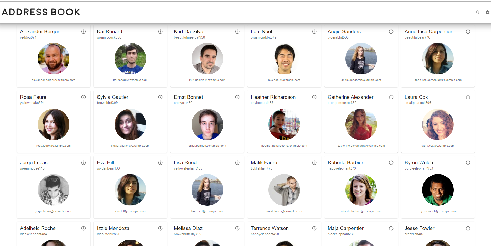
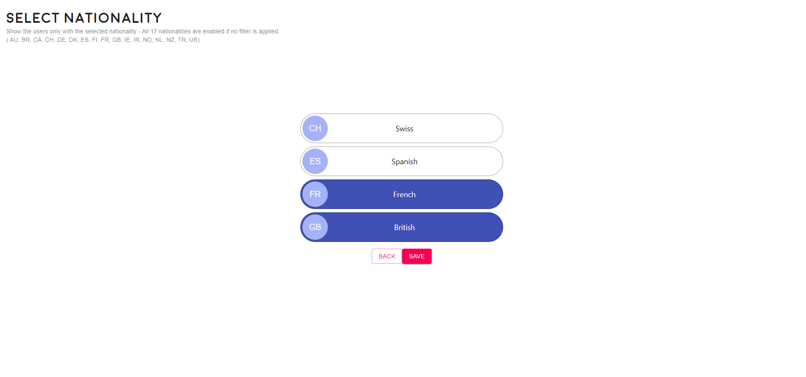
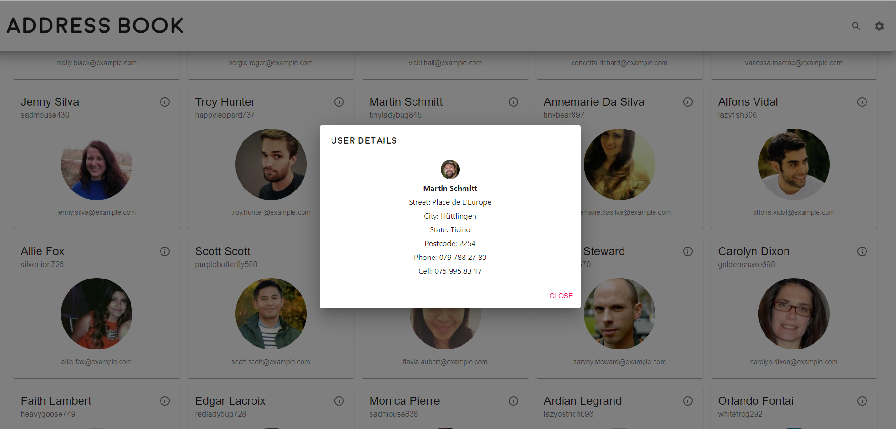
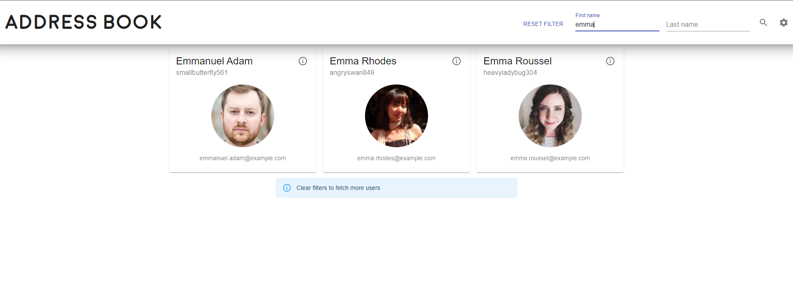

# user_list

This project was bootstrapped with [Create React App](https://github.com/facebook/create-react-app).

## Install app dependencies

- cd into users-app
- npm i

## Available Scripts

In the users-app directory, you can run:

- npm start
- npm test (OR npm test -- --coverage) More tests will be added in following commits!

# Views

## Main View

- Main View renders a grid of user cards, a debounced (1s) firstName/lastName filter and an option to go to the settings page.
- The data is fetched in batches (50) from the https://randomuser.me thorugh react-query.
- The next 50 users data is always prefetched until we reach the end of catalogue (1000 users).
- Further details modal window is available for each user by clicking on the info button on the user card.
- Data fetching/prefetching is stopped while the name filters are active, so the search is performed on the fetched data only.

  

## Settings View

- All the 17 nationalities are enabled by default (when no nationality filter is selected).
- To narrow down the users by nationality, one or more of "CH", "ES", "FR", "GB" can be selected.
- Saving the results will store the filter set in the local storage with "NationalityList" key to persisit between refreshes.

  

## Details modal

- User card's info button shows a modal window with further details of the given user.

  

## Name filters

- Clicking on the search icon makes the firstname & lastname filters available.
- Filtering happens only on the already fetched data and further fetching is disabled while any search pattern is present.
- Filtering is debounced with 1 second.

  

